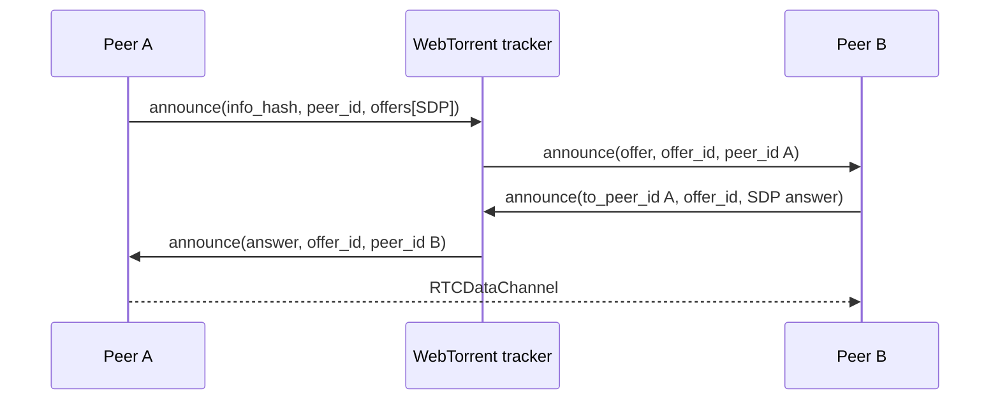

# Análise do P2PT original

## Escopo e método

O repositório solicitado é `subins2000/p2pt`. Esta análise usa a arquitetura e API pública historicamente documentadas do projeto; a clonagem direta foi bloqueada pelo proxy deste ambiente (HTTP 403), portanto cada detalhe de implementação deve ser conferido contra um checkout upstream antes de uma migração de produção. Não houve cópia de código upstream neste projeto.

## Arquitetura e fluxo observado

A biblioteca original expõe uma instância orientada a eventos que recebe uma *topic*, abre conexões WebSocket para trackers compatíveis com WebTorrent e usa o protocolo `announce` do tracker. Um peer envia uma SDP offer em `offers`; o tracker a entrega a outro peer da mesma `info_hash`; este responde com `answer`, `offer_id` e `to_peer_id`. Depois da SDP, o payload da aplicação viaja no canal de dados WebRTC, e não pelo tracker.

## Acoplamentos e riscos que motivam a substituição

| Área | Problema/riscos | Direção adotada |
|---|---|---|
| Signaling e peer | Fluxo de tracker, SDP e objetos de peer tendem a ficar no mesmo controlador. | Adaptador de tracker isolado e `PeerManager`. |
| Signaling repetido | Reannounces e offers podem produzir conexões concorrentes ou respostas órfãs. | IDs de offer, mapa de offers pendentes com expiração e uma conexão por peer. |
| ICE | Enviar SDP antes de reunir ICE pode exigir trickle complexo; esperar indefinidamente bloqueia conexão. | Não-trickle MVP com timeout de gathering; `rtcConfig` permite TURN em produção. |
| DataChannel | Envio em loop ignora `bufferedAmount`, elevando memória/latência. | Fila serial e `bufferedAmountLowThreshold`. |
| Lifecycle | Sockets, timers, listeners e peers precisam ser fechados juntos. | `leave()`/`destroy()` limpam tracker, timer, peers e streams. |
| Arquivos | Metadados sem limite ou chunks sem validação permitem consumo de memória. | Limites configuráveis, validação de chunk, cancelamento e SHA-256 final. |

## O que manter e o que descartar

Mantém-se o conceito central: room derivada em `info_hash`, WebTorrent trackers apenas como discovery/signaling, WebRTC para dados e uma API de eventos. Substituem-se APIs WebRTC obsoletas (como `addStream`) por `addTrack`, dependências de conveniência por Web APIs e acoplamento entre file transfer e signaling. Compatibilidade completa com cada método legado não é objetivo: `join`, eventos de conexão e envio são preservados conceitualmente, enquanto a nova API assume `Promise`s e `send(peer, data)` explícito.
