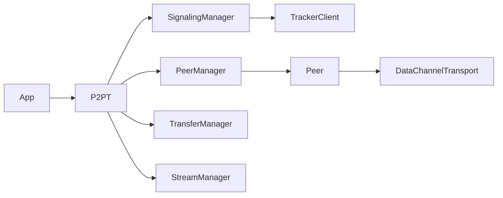

# Design do MVP

## Decisões

- **ESM JavaScript + declarações `.d.ts`:** não há dependência de runtime; o build copia módulos e publica tipos. TypeScript integral acrescentaria uma etapa/transpilador para uma biblioteca cujo código usa predominantemente APIs DOM já tipadas. A API pública ainda é tipada.
- **WebTorrent tracker protocol:** `SignalingManager` limita-se a `announce`, SDP offers e answers. A room é SHA-256 truncado a 20 bytes para o `info_hash`; ela não é segredo nem controle de acesso.
- **Não-trickle ICE no MVP:** oferece compatibilidade com tracker sem encaminhar candidates individuais. Há timeout de 8s. Aplicações atrás de NAT restritivo devem fornecer TURN por `rtcConfig`.
- **Canal confiável/ordenado:** mensagens e arquivo usam um DataChannel `ordered: true`; arquivos exigem reconstrução correta. Streaming de câmera/tela usa tracks RTP (`addTrack`), que é adequado à latência. Streaming de dados segmentados pode usar o mesmo transporte com protocolo próprio numa versão posterior; não é confundido com upload de arquivo neste MVP.
- **Arquivo:** `file-start`, frames binários com `id:index:` e `file-end`. Não há ACK por chunk: SCTP já provê confiabilidade/ordem e o backpressure regula a janela. O hash SHA-256 final protege integridade, não autenticação.

## Limitações conscientemente aceitas

Receber um arquivo monta os chunks em memória para criar um `File`, o único caminho portável de MVP; envio usa `Blob.slice()` e não lê o arquivo todo antecipadamente. Não há autenticação, persistência, retransmissão própria, data streaming especializado ou fallback para relay. Peers e trackers não são confiáveis.
