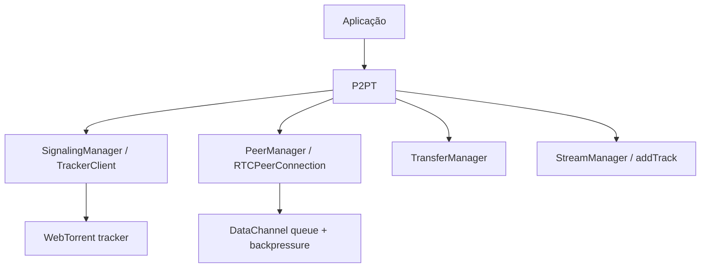

# P2PT Modern

Uma biblioteca browser-first, pequena e modular para formar uma mesh WebRTC usando **WebTorrent trackers somente para discovery e signaling**. Depois do handshake, mensagens, arquivos e mídia passam diretamente entre peers.

> **MVP:** os trackers não autenticam peers nem protegem a room. Trate toda entrada como não confiável e configure TURN/autorização na aplicação quando necessário.

## Instalação e uso

```bash
npm install
npm run build
```

```js
import P2PT from 'p2pt-modern';

const p2p = new P2PT({
  trackers: ['wss://tracker.openwebtorrent.com', 'wss://tracker.webtorrent.dev'],
  rtcConfig: { iceServers: [{ urls: 'stun:stun.l.google.com:19302' }] }
});

p2p.on('peerconnect', (peer) => console.log('connected', peer.id));
p2p.on('message', (peer, data) => console.log(peer.id, data));
p2p.on('file-progress', (_peer, transfer) => console.log(transfer.progress));
p2p.on('stream', (_peer, stream) => { remoteVideo.srcObject = stream; });
await p2p.join('my-room');

await p2p.broadcast('hello');
await p2p.sendFile(p2p.peers[0], input.files[0]);
const stopSharing = p2p.addStream(await navigator.mediaDevices.getUserMedia({ video: true, audio: true }));
```

## Arquitetura



O `SignalingManager` transforma a room em `info_hash`, anuncia uma SDP offer por tracker e recebe a SDP answer correspondente. Cada `Peer` possui um `RTCPeerConnection`; após conectar, o tracker fica fora do caminho de dados. Offers expiram em 60 segundos, sockets reconectam com backoff e `leave()` fecha peers e timer de announce.

## API

### `new P2PT(options)`

Opções: `trackers`, `peerId`, `rtcConfig`, `announceInterval`, `transfer.chunkSize` (padrão 16 KiB) e `transfer.maxFileSize` (padrão 1 GiB). Forneça TURN em `rtcConfig.iceServers` quando STUN direto não for suficiente.

- `await join(room)` / `leave()` / `destroy()` — entra, sai e libera recursos.
- `peers` e `getPeers()` — peers conectados.
- `send(peer, data)` e `broadcast(data)` — mensagens `string` ou `ArrayBuffer` de até 64 KiB.
- `sendFile(peer, file)` / `cancelFile(id)` — upload de `Blob`/`File` e cancelamento.
- `addStream(mediaStream)` / `removeStream(stream)` — replica tracks usando `RTCPeerConnection.addTrack()`, não a API obsoleta `addStream()`.
- `stats()` — `{ peers, connected, connecting, bytesSent, bytesReceived, messagesSent, messagesReceived }`.

### Eventos

| Evento | Argumentos |
|---|---|
| `join`, `leave` | `room` |
| `peerconnect` | `peer` |
| `peerclose`, `peererror` | `peer`, `error` |
| `message` | `peer`, `data` |
| `stream` | `peer`, `MediaStream` |
| `file-start`, `file-progress`, `file-complete`, `file-cancel` | `peer`, `TransferInfo` |
| `file-error` | `peer`, `TransferInfo`, `error` |
| `error` | `error` |

`TransferInfo` contém `id`, `name`, `size`, `type`, `transferred`, `progress` e `totalChunks`. O envio lê `Blob.slice()` por chunk e aguarda a fila do DataChannel; o receptor valida tamanho/ordem, monta um `File` e confere SHA-256 ao fim. A integridade não substitui assinatura nem criptografia de aplicação.

## Segurança, compatibilidade e limites

Chrome, Edge, Firefox e Safari atuais com WebRTC, WebSocket, Web Crypto e `File` são o alvo. Limite room, mensagem, arquivo, transfers simultâneos e chunks antes de usar em ambientes hostis. Não exponha conteúdo sensível pela room, não confie no ID do peer, implemente autorização/criptografia de aplicação se necessário e lembre que trackers públicos podem estar indisponíveis. O envio de arquivo é eficiente em leitura; a reconstrução do destinatário ainda ocupa memória proporcional ao arquivo.

Veja [ARCHITECTURE.md](ARCHITECTURE.md) para análise do original e [DESIGN.md](DESIGN.md) para decisões/limitações. `demo/` é uma página estática de demonstração.
